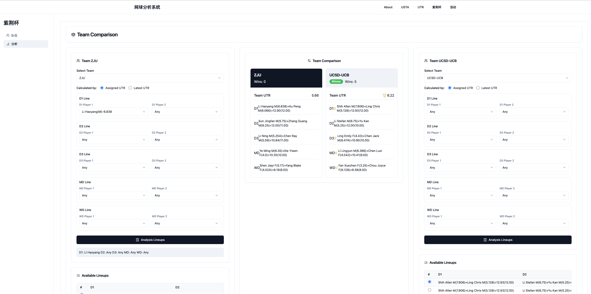

# 🎾 Tennis Analysis App

A web application for advanced analysis of **UTR** and **USTA** players and matches — helping you scout players, compare teams, and predict outcomes with data-driven insights.

Built with the **Vue.js framework**, **Tailwind CSS**, and **shadcn/ui** components for high performance, scalability, and a beautiful user interface.

---

## ✨ Features

### 1. UTR Match Analysis

- Browse all events hosted by the **Bay Area Tennis Club**.
- Explore divisions, player lists, and complete match histories.
- **Player Search**  
  Search for players by name or ID to view detailed match histories.
- **Player Comparison**  
  Compare two players side by side:
  - UTR ratings
  - Match history
  - Common opponents
  - Predict outcomes of upcoming matches based on historical data

### 2. Zijing Cup Analysis

- View all participating teams and their members.
- Analyze the **top 5 player pairs** in each line:
  - Men's Doubles D1, D2, D3
  - Mixed Doubles
  - Women's Doubles
- **Team Comparison Tool**
  - Fix players to specific lines
  - Explore the top 5 lineup combinations
  - Compare potential lineups and projected match outcomes

### 3. USTA Match Analysis

- **League Overview**  
  Browse divisions and flights across **South Bay (SB)**, **Mid Peninsula (MP)**, and **Lower Peninsula (LP)**.  
  Access team rosters, player details, match histories, and analysis.

- **Candidate Teams**  
  Review team profiles, including basic details and player lists.

- **Team Search**  
  Find teams by name to view team details, player lineups, and match records.
  - Direct UTR editing for team members with visual feedback
  - Batch UTR updates for multiple players simultaneously
  - Checkbox selection system for efficient multi-player operations
  - Visual indicators showing which values were recently updated
  - Automatic refresh status management

- **Player Search**  
  Look up players by name to access profiles, team affiliations, and USTA/UTR match histories.

- **Player Finder**  
  Discover top players using filters:
  - UTR rating
  - USTA rating
  - Age range
  - Gender
  - Bay Area region

- **Player Statistics**  
  Analyze aggregated player data:
  - UTR range
  - Average UTR
  - Other performance metrics

- **Team Analysis**  
  Compare two teams within the same league:
  - Team ratings
  - Lineup strengths
  - Historical win rates
  - Top players and best-performing pairs

### 4. Event: Team Building

- Build and customize teams dynamically.
- Explore potential player candidates and top-performing pairs based on event formats and team needs.

---

## 🖼️ Screenshots & Demo

### USTA Player Overview


### USTA Team Overview


### USTA Team Analysis


### Zijing Team Analysis


---

## 🛠️ Tech Stack

| Technology       | Description                                |
| ---------------- | ------------------------------------------ |
| **Vue.js**       | Frontend framework for building the app    |
| **Tailwind CSS** | Utility-first CSS framework for styling    |
| **shadcn/ui**    | Beautifully designed UI components         |
| **Pinia**        | Vue state management                       |
| **Axios**        | HTTP client for API requests               |
| **Chart.js**     | Data visualization and charts              |
| **Node.js**      | Runtime environment                        |
| **npm**          | Package manager                            |
| **Lucide Icons** | Beautiful & consistent icon set            |

---

## 🎨 UI Components

The application uses **shadcn/ui** components, which are beautifully designed components built with Tailwind CSS and Radix UI. These components provide:

- **Consistent Design**: A cohesive look and feel across the entire application
- **Accessibility**: Built with accessibility in mind
- **Customization**: Easily customizable to match your brand
- **Dark Mode Support**: Seamless light/dark mode switching
- **Responsive Design**: Works on all screen sizes

### Key Components

- **Cards**: For organized content presentation with headers, titles, and content sections
- **Tables**: Enhanced data display with sortable columns, pagination, and responsive layouts
  - TableHeader, TableBody, TableRow, TableHead, and TableCell components for structured data presentation
  - Consistent styling across all table-based views
- **Buttons**: Various styles (primary, secondary, outline, ghost) and states
- **Form Elements**: Selects, inputs, and other interactive controls
- **Navigation**: Sidebar navigation with active state indicators
- **Badges**: Status indicators with different variants (default, outline, success)
- **Loading Spinners**: Consistent loading indicators throughout the application

### Recent UI Improvements

- **Expanded Card Widths**: Increased space for club, division, team, and player lists for better information display
- **Standardized Tables**: Converted all tables to use shadcn components for consistent styling
- **Improved Player Information Layout**: Optimized player data display with inline UTR ratings
- **Responsive Design Enhancements**: Better layout on various screen sizes
- **Consistent Loading States**: Unified loading spinner design across all components

---

## 🚀 Getting Started

### Prerequisites

- Node.js (v16+ recommended)
- npm (comes bundled with Node.js)

### Installation

```bash
git clone https://github.com/austinxyz/tennis-analysis-app.git
cd tennis-analysis-app
npm install
npm run dev
```

The application will be available at `http://localhost:5173` (or the port specified by Vite).

### Building for Production

```bash
npm run build
```

This will generate optimized production files in the `dist` directory.

---

## 📱 Responsive Design

The application is fully responsive and works seamlessly across:

- **Desktop**: Full-featured experience with expanded views
- **Tablet**: Optimized layouts for medium-sized screens
- **Mobile**: Condensed views with touch-friendly controls

Key responsive features include:
- Flexible card layouts that adapt to screen width
- Tables that remain readable on smaller screens
- Navigation that collapses appropriately on mobile devices
- Touch-optimized controls for mobile users

---

## 🔄 Recent Updates

- **UI Enhancement**: Implemented shadcn table components across all USTA-related pages
- **Layout Improvements**: Expanded space for club, division, team, and player lists
- **Player Information**: Optimized player data display with inline UTR ratings
- **Performance Optimization**: Improved loading times for data-heavy pages
- **Responsive Design**: Enhanced mobile and tablet experiences

---

## 📝 License

This project is licensed under the MIT License - see the LICENSE file for details.

---

## 👥 Contributors

- Austin Xu - Project Lead & Developer
