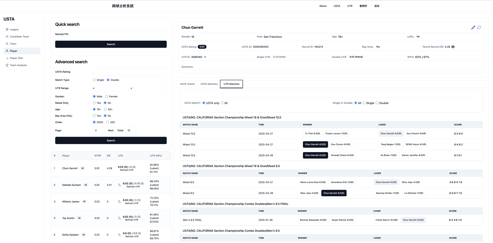

# 🎾 Tennis Analysis App

A web application for advanced analysis of **UTR** and **USTA** players and matches — helping you scout players, compare teams, and predict outcomes with data-driven insights.

Built with the **Vue.js framework** and **Tailwind CSS** for high performance and scalability.

---

## ✨ Features

### 1. UTR Match Analysis

- Browse all events hosted by the **Bay Area Tennis Club**.
- Explore divisions, player lists, and complete match histories.
- **Player Search**  
  Search for players by name or ID to view detailed match histories.
- **Player Comparison**  
  Compare two players side by side:
  - UTR ratings
  - Match history
  - Common opponents
  - Predict outcomes of upcoming matches based on historical data

### 2. Zijing Cup Analysis

- View all participating teams and their members.
- Analyze the **top 5 player pairs** in each line:
  - Men's Doubles D1, D2, D3
  - Mixed Doubles
  - Women's Doubles
- **Team Comparison Tool**
  - Fix players to specific lines
  - Explore the top 5 lineup combinations
  - Compare potential lineups and projected match outcomes

### 3. USTA Match Analysis

- **League Overview**  
  Browse divisions and flights across **South Bay (SB)**, **Mid Peninsula (MP)**, and **Lower Peninsula (LP)**.  
  Access team rosters, player details, match histories, and analysis.

- **Candidate Teams**  
  Review team profiles, including basic details and player lists.

- **Team Search**  
  Find teams by name to view team details, player lineups, and match records.
  - Direct UTR editing for team members with visual feedback
  - Batch UTR updates for multiple players simultaneously
  - Checkbox selection system for efficient multi-player operations
  - Visual indicators showing which values were recently updated
  - Automatic refresh status management

- **Player Search**  
  Look up players by name to access profiles, team affiliations, and USTA/UTR match histories.

- **Player Finder**  
  Discover top players using filters:
  - UTR rating
  - USTA rating
  - Age range
  - Gender
  - Bay Area region

- **Player Statistics**  
  Analyze aggregated player data:
  - UTR range
  - Average UTR
  - Other performance metrics

- **Team Analysis**  
  Compare two teams within the same league:
  - Team ratings
  - Lineup strengths
  - Historical win rates
  - Top players and best-performing pairs

### 4. Event: Team Building

- Build and customize teams dynamically.
- Explore potential player candidates and top-performing pairs based on event formats and team needs.

---

## 🖼️ Screenshots & Demo

### USTA Player Overview


### USTA Team Overview


### USTA Team Analysis


### Zijing Team Analysis


---

## 🛠️ Tech Stack

| Technology       | Description                              |
| ---------------- | ---------------------------------------- |
| **Vue.js**       | Frontend framework for building the app  |         |
| **Tailwind CSS** | Utility-first CSS framework for styling  |
| **Pinia**        | Vue state management                     |
| **Axios**        | HTTP client for API requests             |
| **Chart.js**     | Data visualization and charts            |
| **Node.js**      | Runtime environment                      |
| **npm**          | Package manager                          |

---

## 🚀 Getting Started

### Prerequisites

- Node.js (v16+ recommended)
- npm (comes bundled with Node.js)

### Installation

```bash
git clone https://github.com/austinxyz/tennis-analysis-app.git
cd tennis-analysis-app
npm install
npm run dev
